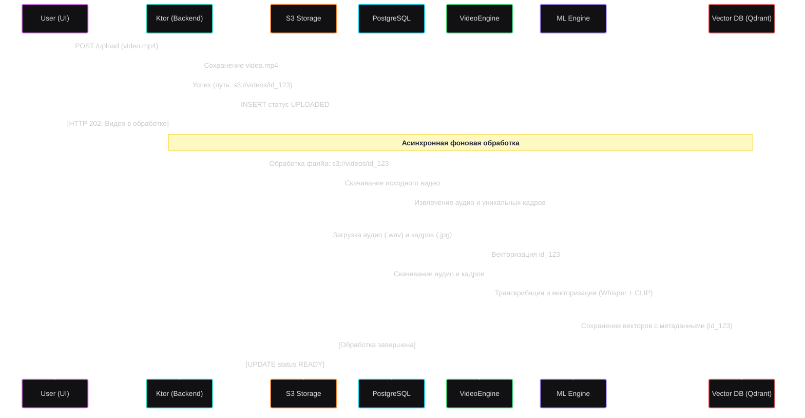

```mermaid
---
config:
  theme: redux-dark-color
---
sequenceDiagram
    participant U as User (UI)
    participant K as Ktor (Backend)
    participant S3 as S3 Storage
    participant DB as PostgreSQL
    participant VE as VideoEngine
    participant M as ML Engine
    participant V as Vector DB (Qdrant)

    U->>K: POST /upload (video.mp4)
    K->>S3: Сохранение video.mp4
    S3-->>K: Успех (путь: s3://videos/id_123)
    K->>DB: INSERT статус UPLOADED
    K-->>U: [HTTP 202: Видео в обработке]
    Note over K, V: Асинхронная фоновая обработка
    K->>VE: Обработка фалйа: s3://videos/id_123
    VE->>S3: Скачивание исходного видео
    VE->>VE: Извлечение аудио и уникальных кадров
    VE->>S3: Загрузка аудио (.wav) и кадров (.jpg)
    VE->>M: Векторизация id_123
    M->>S3: Скачивание аудио и кадров
    M->>M: Транскрибация и векторизация (Whisper + CLIP)
    M->>V: Сохранение векторов с метаданными (id_123)
    M->>K: [Обработка завершена]
    K->>DB: [UPDATE status READY]
```