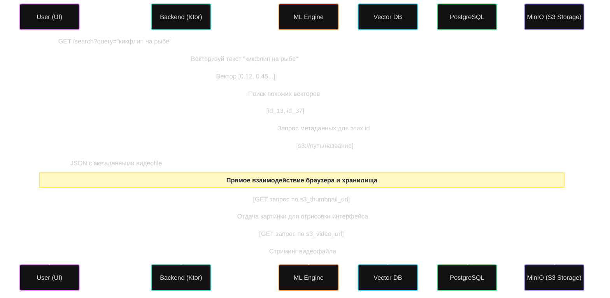

```mermaid
---
config:
  theme: redux-dark-color
---
sequenceDiagram
    participant U as User (UI)
    participant K as Backend (Ktor)
    participant ML as ML Engine
    participant V as Vector DB
    participant DB as PostgreSQL
    participant S3 as MinIO (S3 Storage)

    U->>K: GET /search?query="кикфлип на рыбе"
    K->>ML: Векторизуй текст "кикфлип на рыбе"
    ML-->>K: Вектор [0.12, 0.45...]
    K->>V: Поиск похожих векторов   
    V-->>K: [id_13, id_37]
    K->>DB: Запрос метаданных для этих id
    DB-->>K:[s3://путь/название]
    K-->>U: JSON с метаданными видеоfile
    Note over U, S3: Прямое взаимодействие браузера и хранилища
    U->>S3: [GET запрос по s3_thumbnail_url]
    S3-->>U: Отдача картинки для отрисовки интерфейса
    U->>S3: [GET запрос по s3_video_url]
    S3-->>U: Стриминг видеофайла
```