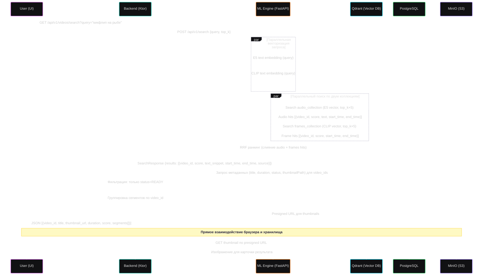

# Retrieval Pipeline — Гибридный семантический поиск

Пайплайн поиска выполняет **мультимодальный семантический поиск** по загруженным видео — одновременно по аудио-транскрипции (E5) и визуальному контенту кадров (CLIP). Результаты объединяются через **RRF (Reciprocal Rank Fusion)**.

## Sequence Diagram

## Ключевые детали

### RRF (Reciprocal Rank Fusion)
- **Формула:** `score = Σ 1 / (K + rank)`, где `K = 60` (каноническое значение)
- Хиты из audio и frames каналов сливаются в **бакеты** по `(video_id, overlapping time interval)`
- Если аудио-хит и frame-хит пересекаются по времени → они попадают в один бакет, и RRF-скор суммируется
- Поле `source` в ответе: `"audio"`, `"frames"`, `"both"` — показывает, из каких каналов пришёл результат

### Обогащение на Backend
- Backend получает плоский список `[{video_id, score, text_snippet, start_time, end_time}]` от ML Engine
- Группирует по `video_id` → собирает `segments[]` с лучшим скором как основным
- Фильтрует: только видео со статусом `READY` (игнорирует `PROCESSING_*`, `ERROR`)
- Генерирует presigned URL для thumbnails через MinIO SDK