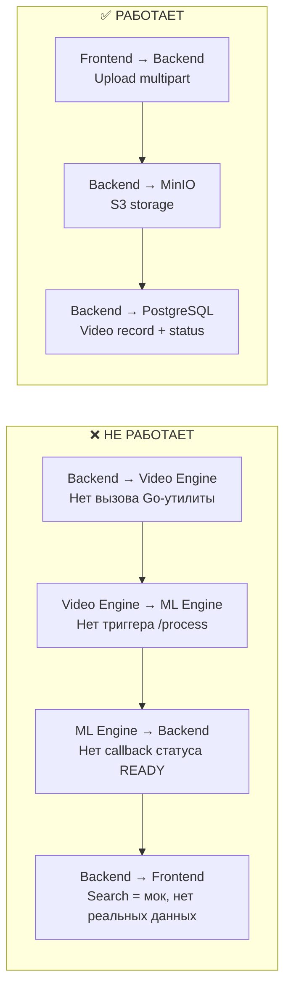
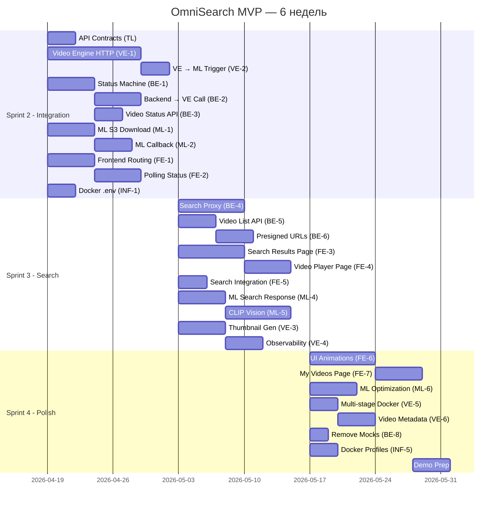

# 🔍 OmniSearch Engine — MVP Development Plan

**Дедлайн:** ~1 июня 2026 (6 недель от 19 апреля)  
**Формат:** 3 спринта × 2 недели  
**Текущая дата:** 19.04.2026

---

## 📊 Анализ текущего состояния

### Что сделано (Sprint 1 — "Foundation")

| Сервис | Статус | Что реализовано |
|--------|--------|-----------------|
| **Backend (Ktor)** | 🟡 ~40% | Upload endpoint (`POST /upload`) → S3 (MinIO) + запись в PostgreSQL. Search endpoint — **мок** (возвращает хардкод). DI (Koin), CORS, Exceptions настроены. |
| **Frontend (React)** | 🟡 ~30% | SPA-каркас (Vite + TS). Drag-and-Drop загрузка с progress bar (Zustand). Строка поиска — **заглушка** (toast). Нет страницы результатов поиска. |
| **Video Engine (Go)** | 🟢 ~60% | CLI-утилита с параллельной обработкой. FFmpeg audio extraction + GoCV frame sampling (1 FPS). Pipeline processor (goroutines). Работает **только локально как CLI**, нет IPC с Backend. |
| **ML Engine (Python)** | 🟢 ~65% | FastAPI сервис. Whisper large-v3 (INT8) транскрибация. E5-base эмбеддинги. Qdrant интеграция (upsert + search). Роуты `/process` и `/search`. |
| **Infra (Docker)** | 🟡 ~50% | docker-compose с 7 сервисами. Dockerfile для каждого микросервиса. CI pipeline (GitHub Actions) — базовый (build/lint). Shared volume между Video Engine и MinIO. |

---

### 🔴 Критические разрывы (Blocker-ы для MVP)

> [!CAUTION]
> **Ingestion Pipeline полностью разорван.** Загруженное видео сохраняется в S3 и на этом всё. Нет ни единого шага, который инициирует обработку видео через Video Engine и ML Engine. Это главный блокер MVP.

> [!WARNING]
> **Retrieval Pipeline = Mock.** Эндпоинт `GET /search` возвращает хардкод. Нет реального взаимодействия Backend ↔ ML Engine ↔ Qdrant для поиска.

> [!WARNING]
> **Video Engine — dead container.** Dockerfile заканчивается `tail -f /dev/null`. Go-утилита работает только через CLI-флаги, нет HTTP API / gRPC / стандартного IPC для вызова из Backend.

---

## 🏗 Архитектурные решения для MVP

### IPC-стратегия для Video Engine

> [!IMPORTANT]
> **Рекомендация:** Преобразовать Video Engine из CLI-утилиты в **HTTP-микросервис** (Fiber/Chi/net-http). Backend вызывает `POST /process` → Video Engine скачивает видео из S3, нарезает, загружает артефакты в S3, и делает callback к Backend.
> 
> **Альтернатива (проще):** Backend вызывает Video Engine как **subprocess** через `shared_media` volume. Но это плохо масштабируется и усложняет error handling.

### Статусная машина видео

Текущие статусы: `UPLOADING`, `UPLOADED`, `FAILED`.  
**Нужно расширить до:** `UPLOADED` → `PROCESSING_MEDIA` → `PROCESSING_ML` → `READY` → `ERROR`

### Контракт поиска

Backend должен проксировать поисковые запросы в ML Engine (`POST /api/v1/search`), получать `video_id` + `score` + `timestamp`, обогащать из PostgreSQL и отдавать на Frontend.

---

## 📅 Sprint Plan

### Sprint 2 (19 апреля → 3 мая): **"Integration & E2E Pipeline"**

**Фокус:** Связать все сервисы в единый Ingestion Pipeline. После этого спринта загруженное видео должно пройти полный путь: Upload → Processing → READY.

### Sprint 3 (3 мая → 17 мая): **"Search & Results"**

**Фокус:** Реализовать полный Retrieval Pipeline. Frontend отображает реальные результаты поиска с метаданными и отрезками видео.

### Sprint 4 (17 мая → 1 июня): **"Polish, Demo & Hardening"**

**Фокус:** Стабилизация, UI/UX доработки, видеоплеер с таймкодами, error handling, демо-сценарий.

---

## 📋 Бэклог задач по участникам

---

## 👑 Тимлид + Video Engine (Go) — *ты*

---

### Sprint 2

#### VE-1: Превращение Video Engine в HTTP-микросервис
**Описание:** Преобразовать текущую CLI-утилиту в HTTP-сервис (net/http или fiber). Эндпоинт `POST /process` принимает `video_id` и `s3_path`, скачивает видео из MinIO, запускает pipeline (audio + frames), загружает результаты обратно в S3, и шлёт callback к Backend.

**AC:**
- Video Engine запускается как long-running HTTP-сервер на порту `:8081`
- `POST /process` принимает JSON `{"video_id": "uuid", "s3_path": "videos/file.mp4"}`
- Видеофайл скачивается из MinIO (S3 SDK)
- Audio extraction (FFmpeg) и frame sampling (GoCV) работают параллельно (существующий pipeline)
- Результаты (`audio.wav`, `frames/*.jpg`) загружаются в MinIO в структуру `media/{video_id}/audio.wav` и `media/{video_id}/frames/`
- По окончании — HTTP-callback к Backend `PUT /api/v1/videos/{id}/status` с телом `{"status": "PROCESSING_ML"}`
- При ошибке — callback со статусом `ERROR`
- Health check `GET /health` возвращает `200`

**Подзадачи:**
- [ ] Добавить S3 клиент (MinIO SDK для Go)
- [ ] Реализовать download/upload из/в MinIO
- [ ] Создать HTTP-эндпоинты (POST /process, GET /health)
- [ ] Адаптировать pipeline.Process для работы с S3-путями
- [ ] Реализовать callback к Backend
- [ ] Обновить Dockerfile (убрать `tail -f`, добавить `CMD`)
- [ ] Обновить docker-compose (порт, health check)

---

#### VE-2: Тригер ML Engine после нарезки
**Описание:** После успешной загрузки артефактов в S3, Video Engine отправляет HTTP-запрос к ML Engine (`POST /api/v1/process`) с `video_id` и путём к аудиофайлу, чтобы запустить транскрибацию и векторизацию.

**AC:**
- После успешного upload артефактов в S3, Video Engine отправляет `POST http://ml_engine:8000/api/v1/process` с JSON `{"video_id": "uuid", "audio_path": "/путь-в-S3"}`
- ML Engine возвращает `202 Accepted`
- Если ML Engine недоступен — retry (3 попытки с exponential backoff)
- Логирование каждого этапа

**Подзадачи:**
- [ ] HTTP-клиент для вызова ML Engine
- [ ] Retry-логика
- [ ] Интеграционный тест (curl/httpie)

---

#### TL-1: Определить контракты API между сервисами
**Описание:** Формализовать JSON-контракты для всех inter-service вызовов: Backend → Video Engine, Video Engine → ML Engine, Video Engine → Backend (callback), Backend → ML Engine (search proxy).

**AC:**
- Документ/OpenAPI с контрактами для: `POST /process` (VE), `PUT /api/v1/videos/{id}/status` (Backend callback), `POST /api/v1/process` (ML), `POST /api/v1/search` (ML)
- Контракты согласованы со всеми участниками
- Обновлён `docs/api/openapi.yaml`

**Подзадачи:**
- [ ] Описать JSON body для каждого inter-service эндпоинта
- [ ] Провести ревью контрактов с командой
- [ ] Обновить OpenAPI

---

### Sprint 3

#### VE-3: Генерация thumbnail для результатов поиска
**Описание:** При нарезке кадров сохранять **первый кадр** (или кадр на 1-й секунде) как thumbnail и загружать его в S3 по пути `media/{video_id}/thumbnail.jpg`.

**AC:**
- Thumbnail генерируется автоматически при обработке видео
- Файл загружается в S3 по пути `media/{video_id}/thumbnail.jpg`
- Thumbnail доступен для Frontend через S3 URL
- Размер thumbnail: 320x180 (16:9, resize через GoCV)

**Подзадачи:**
- [ ] Добавить resize-логику в sampler.go
- [ ] Загрузка thumbnail в S3
- [ ] Тест на корректность формата и размера

---

#### VE-4: Graceful shutdown и observability
**Описание:** Добавить корректное завершение при `SIGTERM` (Docker stop), health check для docker-compose, и structured logging.

**AC:**
- `SIGTERM`/`SIGINT` обрабатываются, текущая задача завершается корректно
- Health check в docker-compose: `healthcheck` → `GET /health`
- Логи в формате JSON (slog или zerolog)

**Подзадачи:**
- [ ] Graceful shutdown (context cancellation)
- [ ] Structured logging
- [ ] docker-compose healthcheck

---

### Sprint 4

#### VE-5: Оптимизация: Multi-stage Dockerfile
**Описание:** Переписать Dockerfile на multi-stage build для уменьшения размера образа.

**AC:**
- Первая stage: build Go бинарник
- Вторая stage: runtime с FFmpeg + OpenCV (minimal)
- Финальный образ < 500MB (по возможности)

---

#### VE-6: Метаданные видео (длительность, FPS, разрешение)
**Описание:** Извлекать базовые метаданные из видеофайла и отправлять их в callback к Backend.

**AC:**
- Callback содержит `duration_seconds`, `fps`, `resolution`, `frame_count`
- Backend сохраняет метаданные в PostgreSQL

---

---

## ⚙️ Backend (Kotlin/Ktor) — *участник Backend*

---

### Sprint 2

#### BE-1: Статусная машина видео (расширение Video domain)
**Описание:** Расширить `VideoStatus` enum до полной стейт-машины: `UPLOADED → PROCESSING_MEDIA → PROCESSING_ML → READY | ERROR`. Добавить эндпоинт для обновления статуса (internal callback от Video Engine).

**AC:**
- `VideoStatus`: `UPLOADED`, `PROCESSING_MEDIA`, `PROCESSING_ML`, `READY`, `ERROR`
- `PUT /api/v1/videos/{id}/status` принимает `{"status": "PROCESSING_ML"}` — internal API, не для Frontend
- `Video` domain model расширен: `title`, `durationSeconds`, `thumbnailPath`, `createdAt`
- Статус обновляется транзакционно с `updatedAt`

**Подзадачи:**
- [ ] Расширить `VideoStatus` enum
- [ ] Расширить `Video` domain model и `VideoTable`
- [ ] Реализовать `PUT /api/v1/videos/{id}/status` endpoint
- [ ] Обновить `VideoRepository` с новыми полями

---

#### BE-2: Оркестрация Ingestion Pipeline
**Описание:** После успешного upload видео в S3, Backend асинхронно (coroutine) вызывает Video Engine (`POST http://video-engine:8081/process`), передавая `video_id` и `s3_path`, и обновляет статус на `PROCESSING_MEDIA`.

**AC:**
- После `uploadVideoUseCase.execute()` — запуск корутины для вызова Video Engine
- HTTP-клиент (Ktor Client) отправляет `POST /process` к Video Engine
- Статус видео обновляется: `UPLOADED → PROCESSING_MEDIA`
- При недоступности Video Engine — статус `ERROR` + логирование
- Upload endpoint продолжает возвращать `202 Accepted` моментально

**Подзадачи:**
- [ ] Добавить Ktor HTTP Client в зависимости
- [ ] Создать `VideoEngineClient` (interface + impl)
- [ ] Интегрировать вызов в `UploadVideoUseCase` (или отдельный UseCase)
- [ ] Обработка ошибок (timeout, retry)

---

#### BE-3: Эндпоинт получения статуса видео
**Описание:** Реализовать `GET /api/v1/videos/{id}` для polling статуса видео с Frontend.

**AC:**
- `GET /api/v1/videos/{id}` возвращает `VideoResponse` с актуальным статусом
- 404 если видео не найдено
- Response содержит: `id`, `fileName`, `status`, `createdAt`, `updatedAt`

**Подзадачи:**
- [ ] Роут `GET /api/v1/videos/{id}`
- [ ] Маппинг `Video → VideoResponse`
- [ ] Обработка 404

---

### Sprint 3

#### BE-4: Проксирование поиска через ML Engine
**Описание:** Реализовать реальный `GET /api/v1/videos/search`. Backend принимает `?query=text`, проксирует запрос в ML Engine (`POST /api/v1/search`), получает `video_id` + `score` + `timestamps`, обогащает из PostgreSQL (title, thumbnail_url, status) и возвращает на Frontend.

**AC:**
- `GET /api/v1/videos/search?query=...` → вызов ML Engine → обогащение из БД → response
- Response: массив `SearchResultItem` с полями: `video_id`, `title`, `score`, `thumbnail_url`, `start_time`, `end_time`, `text_snippet`
- Фильтрация: только видео со статусом `READY`
- Обработка ошибок: ML Engine недоступен → 503

**Подзадачи:**
- [ ] Создать `MLEngineClient` (interface + impl)
- [ ] Реализовать `SearchVideoUseCase`
- [ ] Обогащение результатов из PostgreSQL
- [ ] Обновить `VideoRoutes` — убрать мок, подключить реальный UseCase
- [ ] Обработка ошибок

---

#### BE-5: Эндпоинт получения списка загруженных видео
**Описание:** `GET /api/v1/videos` — список всех видео с пагинацией для отображения на Frontend.

**AC:**
- `GET /api/v1/videos?page=0&size=20` возвращает список видео
- Сортировка по `createdAt` DESC
- Response содержит: массив `VideoResponse` + `totalCount`

**Подзадачи:**
- [ ] `findAll(page, size)` в `VideoRepository`
- [ ] Роут `GET /api/v1/videos`
- [ ] Пагинация

---

#### BE-6: Presigned URL для стриминга видео
**Описание:** Генерировать MinIO presigned URL для воспроизведения видео прямо в браузере (Frontend → MinIO напрямую).

**AC:**
- `GET /api/v1/videos/{id}/stream` возвращает `{"url": "http://minio:9000/signed-url..."}`
- URL validen в течение 1 часа
- Frontend использует URL для `<video src="...">`

**Подзадачи:**
- [ ] Добавить метод `getPresignedUrl()` в `VideoStorage`
- [ ] Реализация через MinIO getPresignedObjectUrl
- [ ] Роут

---

### Sprint 4

#### BE-7: GET /api/v1/videos/{id}/status — polling endpoint
**Описание:** Лёгкий эндпоинт, возвращающий только статус видео для efficient polling с Frontend.

**AC:**
- Возвращает: `{"status": "PROCESSING_ML", "updated_at": "..."}`
- Оптимизирован для частого вызова

---

#### BE-8: Удаление mock-ов и seed data
**Описание:** Удалить все моковые данные и заглушки из Database.kt и VideoRoutes.kt.

**AC:**
- Mock search endpoint удалён
- Seed data из `configureDatabase()` удалён или вынесен в dev-профиль
- Все эндпоинты работают с реальными данными

---

---

## 💻 Frontend (React/TypeScript) — *участник Frontend*

---

### Sprint 2

#### FE-1: Routing и страничная навигация
**Описание:** Добавить React Router. Разбить SPA на страницы: Главная (поиск + загрузка), Результаты поиска, Просмотр видео.

**AC:**
- `react-router-dom` установлен и настроен
- Роуты: `/` (главная), `/search?query=...` (результаты), `/video/:id` (просмотр)
- Header содержит навигацию между страницами
- 404-страница

**Подзадачи:**
- [ ] Установить react-router-dom
- [ ] Создать Layout компонент
- [ ] Настроить Routes в App.tsx
- [ ] Обновить Header с навигацией

---

#### FE-2: API-слой для polling статуса видео
**Описание:** Реализовать API-функции для получения статуса видео и запуска периодического polling после загрузки.

**AC:**
- `getVideoStatus(videoId)` — вызов `GET /api/v1/videos/{id}`
- Polling каждые 3 секунды после успешной загрузки, пока статус ≠ `READY` или `ERROR`
- UploadProgress отображает текущий шаг обработки: "Загружено → Обработка видео → AI анализ → Готово"
- Polling останавливается при закрытии страницы

**Подзадачи:**
- [ ] API функция `getVideoStatus()`
- [ ] usePolling hook
- [ ] Обновить UploadProgress с визуальными шагами

---

### Sprint 3

#### FE-3: Страница результатов поиска
**Описание:** Реализовать полноценную страницу результатов поиска, отображающую карточки видео с thumbnail, заголовком, score и текстовым сниппетом.

**AC:**
- При отправке запроса из строки поиска → навигация на `/search?query=...`
- `GET /api/v1/videos/search?query=...` вызывается при маунте страницы
- Результаты отображаются карточками (grid/list layout)
- Каждая карточка: thumbnail, title, relevance score (%), text snippet, link to `/video/:id`
- Загрузочное состояние (skeleton loader)
- Пустое состояние ("Ничего не найдено")
- Анимации появления карточек

**Подзадачи:**
- [ ] API функция `searchVideos(query)`
- [ ] Компонент `SearchResultsPage`
- [ ] Компонент `VideoCard`
- [ ] Skeleton loader
- [ ] Пустое состояние
- [ ] Стилизация (CSS Modules)

---

#### FE-4: Страница просмотра видео
**Описание:** Страница `/video/:id` с видеоплеером, метаданными и фрагментом транскрипции.

**AC:**
- HTML5 `<video>` плеер с presigned URL от Backend
- Метаданные: title, upload date, duration
- При переходе из поиска — автоматическая перемотка к `start_time` из результата
- Текстовый фрагмент (snippet) из результата поиска отображается под плеером

**Подзадачи:**
- [ ] API функция `getVideoStream(videoId)`
- [ ] Компонент `VideoPlayerPage`
- [ ] Видеоплеер с поддержкой таймкодов
- [ ] Отображение метаданных

---

#### FE-5: Интеграция Search с реальным API
**Описание:** Подключить строку поиска к реальному Backend API вместо toast-заглушки.

**AC:**
- При submit формы — навигация на `/search?query=...`
- Loading state на кнопке поиска
- Debounce на ввод (300ms) если будет autocomplete
- Обработка ошибок (API недоступен)

**Подзадачи:**
- [ ] Обновить `Search` компонент
- [ ] Навигация через `useNavigate`
- [ ] Error handling

---

### Sprint 4

#### FE-6: UI полировка и анимации
**Описание:** Добавить анимации переходов между страницами, hover-эффекты на карточках, тему (dark mode support).

**AC:**
- Framer Motion для анимаций перехода страниц
- Hover-эффекты на карточках результатов
- Загрузочные скелетоны
- Responsive layout (mobile-friendly)
- Консистентная цветовая палитра

---

#### FE-7: Страница "Мои видео" (загруженные)
**Описание:** Отображение списка всех загруженных видео с их текущими статусами.

**AC:**
- Роут `/my-videos`
- Список с карточками загруженных видео
- Статус каждого видео визуально различим (UPLOADED/PROCESSING/READY/ERROR)
- Кнопка "удалить" (если время позволит)

---

---

## 🧠 ML Engine (Python/FastAPI) — *участник ML*

---

### Sprint 2

#### ML-1: Адаптация /process для работы с S3
**Описание:** Сейчас `/process` принимает локальный `audio_path`. Нужно, чтобы ML Engine скачивал аудио из S3 (MinIO) перед транскрибацией.

**AC:**
- `AudioProcessRequest` принимает `video_id` и `s3_audio_path` (напр. `media/{video_id}/audio.wav`)
- ML Engine скачивает файл из MinIO через boto3/minio-py
- Файл сохраняется во временную директорию, обрабатывается, удаляется
- При ошибке скачивания — HTTP 500 с описанием

**Подзадачи:**
- [ ] Добавить `boto3` или `minio` в requirements.txt
- [ ] Реализовать `S3Service` (download file from MinIO)
- [ ] Обновить `process_audio_task` для работы с S3
- [ ] Cleanup временных файлов

---

#### ML-2: Callback к Backend после завершения обработки
**Описание:** После успешной обработки аудио и сохранения векторов в Qdrant, ML Engine отправляет callback к Backend для обновления статуса: `PROCESSING_ML → READY`.

**AC:**
- HTTP `PUT http://backend:8080/api/v1/videos/{video_id}/status` с `{"status": "READY"}`
- При ошибке обработки — callback с `{"status": "ERROR", "error": "..."}`
- Retry при недоступности Backend (3 попытки)

**Подзадачи:**
- [ ] HTTP-клиент (httpx) для callback
- [ ] Интеграция в `process_audio_task`
- [ ] Error handling и retry

---

#### ML-3: Сохранение start_time/end_time в Qdrant payload
**Описание:** Убедиться, что при upsert в Qdrant payload содержит `start_time` и `end_time` для каждого чанка — это нужно для отображения таймкодов в результатах поиска.

**AC:**
- Qdrant payload включает: `video_id`, `text`, `start_time`, `end_time`, `chunk_index`
- При поиске — payload возвращается полностью
- Верифицировать через Qdrant Dashboard

**Подзадачи:**
- [ ] Проверить текущую реализацию (уже частично есть в routes.py)
- [ ] Добавить `chunk_index` в payload
- [ ] Тест: загрузить аудио → найти в Qdrant → проверить таймкоды

---

### Sprint 3

#### ML-4: Эндпоинт /search — обогащение ответа
**Описание:** Обогатить ответ `/search` дополнительными полями, чтобы Backend мог формировать полноценный `SearchResultItem`.

**AC:**
- Response `/search`: `[{video_id, score, text_snippet, start_time, end_time, chunk_index}]`
- Дедупликация: если несколько чанков одного видео релевантны — группировать, возвращать лучший score
- `top_k` по умолчанию = 10

**Подзадачи:**
- [ ] Обновить `SearchResponse` schema
- [ ] Дедупликация по `video_id`
- [ ] Тест с реальными данными

---

#### ML-5: Vision Embeddings (CLIP) для кадров
**Описание:** **(Nice-to-have для MVP)** Добавить обработку кадров через CLIP-модель: скачивание frames из S3, генерация vision-эмбеддингов, upsert в отдельную Qdrant коллекцию `image_collection`.

**AC:**
- `POST /process` также обрабатывает frames (если переданы)
- Кадры скачиваются из S3
- CLIP model генерирует эмбеддинги
- Эмбеддинги сохраняются в `image_collection` с payload: `video_id`, `frame_path`, `timestamp`
- Поиск по изображениям интегрирован в `/search` (multi-modal)

**Подзадачи:**
- [ ] Добавить CLIP модель (openai/clip-vit-base-patch32)
- [ ] Vision embedding pipeline
- [ ] Новая Qdrant коллекция `image_collection`
- [ ] Обновить `/search` для multi-modal поиска

---

### Sprint 4

#### ML-6: Оптимизация моделей для production
**Описание:** Оптимизировать загрузку моделей: lazy loading, model caching, memory profiling.

**AC:**
- Health check показывает загруженность моделей
- Whisper загружается при первом запросе (lazy) или при старте (eager, configurable)
- Memory usage < 3GB
- Логирование инференс-времени для каждого запроса

---

---

## 🐳 DevOps / Infra — *участник DevOps или тимлид*

---

### Sprint 2

#### INF-1: Настроить .env файл и docker-compose для полного E2E запуска
**Описание:** Создать единый `.env.example` с описанием переменных. Обновить docker-compose для корректного запуска всех 7 сервисов с health checks и depends_on + condition.

**AC:**
- `.env.example` с комментариями
- `docker-compose up` поднимает все сервисы без ошибок
- Health checks для: postgres, minio, qdrant, backend, video-engine, ml-engine
- `depends_on` с `condition: service_healthy`
- Сеть `omnisearch-network` для всех сервисов
- `volumes` корректно маппятся

**Подзадачи:**
- [ ] Создать `.env.example`
- [ ] Добавить health checks в docker-compose
- [ ] Настроить `depends_on` с conditions
- [ ] Проверить запуск `docker-compose up --build`

---

#### INF-2: Обновить CI pipeline
**Описание:** Обновить GitHub Actions: реальная сборка фронтенда, Go build (без OpenCV для CI), линтинг всех сервисов.

**AC:**
- Frontend: `npm install && npm run build`
- Backend: `./gradlew buildFatJar`
- Video Engine: `go build ./...` (mock CGO или skip на CI)
- ML Engine: `ruff check` + `pip install` (verify deps)
- Все проверки проходят на каждый PR

**Подзадачи:**
- [ ] Обновить check-frontend job
- [ ] Обновить check-cpp-engine → check-go-engine
- [ ] Добавить env variables для CI

---

### Sprint 3

#### INF-3: Настройка MinIO public access для thumbnails
**Описание:** Настроить MinIO bucket policy, чтобы thumbnails были доступны по прямым URL без авторизации (для Frontend).

**AC:**
- Bucket `media` с policy: `public-read` для `media/*/thumbnail.jpg`
- Frontend может загружать thumbnails по прямому URL
- Основные видеофайлы остаются приватными

---

### Sprint 4

#### INF-4: Multi-stage Dockerfile для всех сервисов
**Описание:** Оптимизировать все Dockerfile для уменьшения размера образов.

**AC:**
- Backend: уже multi-stage ✅
- Frontend: уже multi-stage ✅  
- Video Engine: multi-stage (build Go binary → runtime)
- ML Engine: оптимизация слоёв, cache mount для pip

---

#### INF-5: Docker-compose profiles (dev/prod)
**Описание:** Разделить docker-compose на профили: `dev` (с hot-reload, dev tools) и `prod` (оптимизированные образы).

**AC:**
- `docker compose --profile dev up` — с volume mounts для hot-reload
- `docker compose --profile prod up` — production-ready

---

---

## 📊 Roadmap визуализация

---

## 🔑 Рекомендации по процессу

1. **Канбан-доска:** Youtrack / GitHub Projects. Статусы: `TODO → In Progress → Review → Done`
2. **Daily sync:** 15 мин стендап (текст в Telegram/Discord) — что сделал, что планирую, какие блокеры
3. **Weekly demo:** Каждую пятницу — 30 мин демо текущего прогресса
4. **Branch strategy:** `feature/OMNI-XX-description` → PR в `main`. Минимум 1 reviewer.
5. **Приоритет Sprint 2:** Все силы на интеграцию. **VE-1 + BE-2 + ML-1** — это "золотой путь". Пока он не работает, ничего другого не имеет смысла.

> [!IMPORTANT]
> **Главный KPI для Sprint 2:** `docker-compose up` → загрузить видео через UI → дождаться статуса `READY` → это значит Ingestion Pipeline работает E2E.

> [!IMPORTANT]
> **Главный KPI для Sprint 3:** Ввести текстовый запрос → получить карточки видео с реальными результатами → кликнуть → воспроизвести видео с нужного момента.
