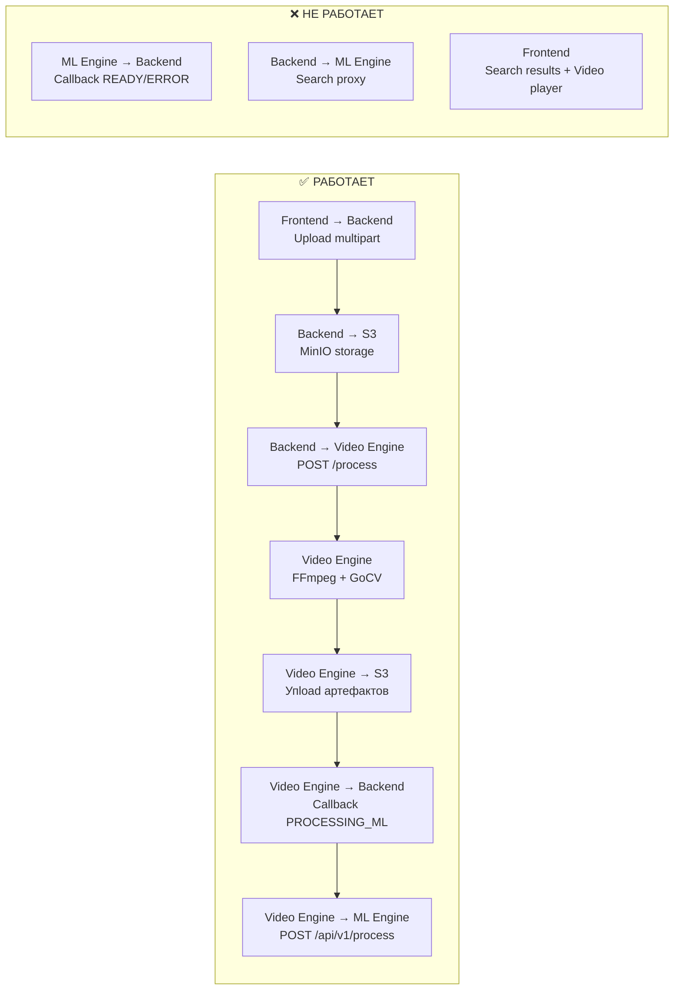
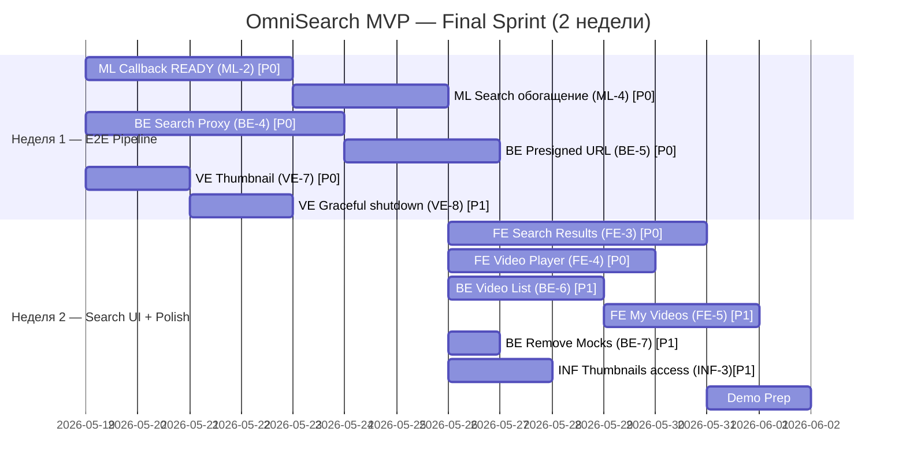

# 🔍 OmniSearch Engine — MVP Development Plan

**Дедлайн:** 2 июня 2026  
**Текущая дата:** 19.05.2026  
**Осталось:** ~2 недели (Final Sprint)  
**Презентация проекта:** ~2 июня 2026

---

## 📊 Анализ текущего состояния (после Sprint 2)

### Что сделано

| Сервис | Статус | Что реализовано |
|--------|--------|-----------------|
| **Backend (Ktor)** | 🟢 ~65% | Upload → S3 + PostgreSQL. Статусная машина (`UPLOADED → PROCESSING_MEDIA → PROCESSING_ML → READY → ERROR`). `PATCH /internal/videos/{id}` — internal callback. `GET /videos/{id}` — получение видео по ID. `VideoEngineClient` — вызов Video Engine из upload pipeline. DI (Koin), CORS, `X-Internal-Secret` auth. **Search — всё ещё мок.** |
| **Frontend (React)** | 🟡 ~45% | SPA-каркас (Vite + TS). React Router: `/`, `/search`, `/video/:id`. Drag-and-Drop загрузка + progress bar (Zustand). API polling статуса видео. **SearchResultsPage — заглушка. VideoPage — заглушка.** |
| **Video Engine (Go)** | 🟢 ~80% | HTTP-микросервис на `:8081`. `POST /process`, `GET /health`. S3 download/upload (MinIO SDK). Параллельный pipeline (FFmpeg + GoCV). Callback к Backend. ML Engine trigger с retry (exponential backoff). **Docker build починен** (gocv/opencv:4.13.0). |
| **ML Engine (Python)** | 🟢 ~70% | FastAPI. Whisper large-v3 транскрибация. E5-base эмбеддинги + Qdrant upsert/search. S3 download интегрирован (OMNI-61). `/process` и `/search` работают. **Нет callback к Backend (READY/ERROR).** |
| **Infra (Docker)** | 🟢 ~75% | docker-compose с 7 сервисами + health checks + `depends_on`. CI pipeline обновлён. `.env.example`. Сеть `omnisearch-network`. |

---

### Что осталось сделать для MVP

> [!CAUTION]
> **Ingestion Pipeline почти замкнут**, но ML Engine не отправляет callback `READY` к Backend → видео навсегда зависает в `PROCESSING_ML`. Это **блокер #1**.

> [!WARNING]
> **Retrieval Pipeline = Mock.** Backend `/search` возвращает хардкод. Нет проксирования к ML Engine. Frontend не отображает реальные результаты.

---

## 📅 Final Sprint (19 мая → 2 июня): **"MVP Delivery"**

**Стратегия:** Все задачи разбиты по приоритетам. **P0** = без этого демо невозможно. **P1** = нужно для полноценного впечатления. **P2** = nice-to-have, делаем если останется время.

### Неделя 1 (19–25 мая): Замкнуть пайплайн E2E
### Неделя 2 (26 мая – 2 июня): Search UI + полировка + демо

---

## 📋 Бэклог задач по участникам

---

## 👑 Тимлид + Video Engine (Go) — *ты*

---

### ✅ Завершённые задачи (Sprint 2)

- [x] **VE-1 (OMNI-65):** Video Engine → HTTP-микросервис (POST /process, GET /health, S3 download/upload, callback)
- [x] **VE-2 (OMNI-86):** ML Engine trigger с exponential backoff retry
- [x] **TL-1 (OMNI-90):** OpenAPI контракты для inter-service API

---

### P0 — Блокеры MVP

#### VE-7: Thumbnail при нарезке (бывший VE-3, упрощённый)
**Описание:** Сохранять первый кадр как thumbnail и загружать в S3. Без resize — просто первый frame как `thumbnail.jpg`.

**AC:**
- Первый сохранённый кадр копируется как `media/{video_id}/thumbnail.jpg`
- Загрузка в S3 в рамках `UploadMedia()`
- Путь `thumbnailPath` передаётся в callback к Backend

**Подзадачи:**
- [x] Копировать первый кадр как thumbnail в `UploadMedia()`
- [x] Добавить `thumbnailPath` в callback payload

---

### P1 — Важное

#### VE-8: Graceful shutdown
**Описание:** Корректное завершение при `SIGTERM` (Docker stop).

**AC:**
- `SIGTERM`/`SIGINT` обрабатываются через `context.WithCancel`
- HTTP-сервер делает `Shutdown(ctx)` с таймаутом 30 секунд

**Подзадачи:**
- [ ] Signal handling в `main.go`
- [ ] `http.Server.Shutdown()` вместо голого `ListenAndServe`

---

### P2 — Nice-to-have

#### VE-9: Метаданные видео в callback
**Описание:** Отправлять `fps`, `resolution`, `frameCount` в callback к Backend.

**AC:**
- Callback содержит дополнительные поля из OpenAPI контракта

---

---

## ⚙️ Backend (Kotlin/Ktor) — *участник Backend*

---

### ✅ Завершённые задачи (Sprint 2)

- [x] **BE-1:** Статусная машина видео (UPLOADED → PROCESSING_MEDIA → PROCESSING_ML → READY → ERROR)
- [x] **BE-2 (OMNI-94):** VideoEngineClient + интеграция с upload pipeline
- [x] **BE-3:** GET /api/v1/videos/{id}
- [x] **OMNI-107:** ML Engine callback (PATCH /internal/videos/{id})

---

### P0 — Блокеры MVP

#### BE-4: Проксирование поиска через ML Engine
**Описание:** Реализовать реальный `GET /api/v1/videos/search`. Backend проксирует запрос в ML Engine (`POST /api/v1/search`), обогащает из PostgreSQL и возвращает на Frontend.

**AC:**
- `GET /api/v1/videos/search?query=...` → ML Engine → обогащение из БД → response
- Response: массив `SearchResultItem` (`video_id`, `title`, `score`, `thumbnail_url`, `start_time`, `end_time`, `text_snippet`)
- Фильтрация: только видео со статусом `READY`
- ML Engine недоступен → 503

**Подзадачи:**
- [ ] Создать `MLEngineClient` (Ktor HTTP Client)
- [ ] `SearchVideoUseCase` с обогащением из PostgreSQL
- [ ] Убрать мок из `VideoRoutes`, подключить реальный UseCase
- [ ] Error handling (timeout, 503)

---

#### BE-5: Presigned URL для стриминга видео
**Описание:** Генерировать MinIO presigned URL для воспроизведения видео в браузере.

**AC:**
- `GET /api/v1/videos/{id}/stream` возвращает `{"url": "http://...signed-url"}`
- URL validen в течение 1 часа

**Подзадачи:**
- [ ] `getPresignedUrl()` в `VideoStorage`
- [ ] Роут `GET /api/v1/videos/{id}/stream`

---

### P1 — Важное

#### BE-6: Список загруженных видео
**Описание:** `GET /api/v1/videos` — список всех видео для отображения на Frontend.

**AC:**
- `GET /api/v1/videos` возвращает массив `VideoResponse`
- Сортировка по `createdAt` DESC

**Подзадачи:**
- [ ] `findAll()` в `VideoRepository`
- [ ] Роут `GET /api/v1/videos`

---

#### BE-7: Удаление мок-данных
**Описание:** Удалить mock search endpoint из `VideoRoutes.kt`.

**AC:**
- Mock `/search` заменён реальной реализацией (BE-4)

---

### P2 — Nice-to-have

#### BE-8: Сохранение расширенных метаданных (fps, resolution)
**Описание:** Принимать и сохранять дополнительные поля из callback Video Engine.

---

---

## 💻 Frontend (React/TypeScript) — *участник Frontend*

---

### ✅ Завершённые задачи (Sprint 2)

- [x] **FE-1:** React Router (/, /search, /video/:id, 404)
- [x] **FE-2 (OMNI-103):** API polling статуса видео после загрузки

---

### P0 — Блокеры MVP

#### FE-3: Страница результатов поиска
**Описание:** Полноценная страница `/search?query=...` с карточками видео.

**AC:**
- При submit поисковой строки → навигация на `/search?query=...`
- Вызов `GET /api/v1/videos/search?query=...`
- Карточки результатов: thumbnail, title, score (%), text snippet
- Клик по карточке → `/video/:id?t=start_time`
- Skeleton loader + пустое состояние ("Ничего не найдено")

**Подзадачи:**
- [ ] API функция `searchVideos(query)`
- [ ] Компонент `SearchResultsPage` (реальная реализация)
- [ ] Компонент `VideoCard`
- [ ] Loading/empty states
- [ ] Подключить Search компонент к навигации

---

#### FE-4: Страница просмотра видео
**Описание:** Страница `/video/:id` с видеоплеером и метаданными.

**AC:**
- HTML5 `<video>` плеер с presigned URL от Backend
- Метаданные: title, duration, upload date
- При переходе из поиска — перемотка к `start_time` из query param
- Текстовый snippet под плеером

**Подзадачи:**
- [ ] API функция `getVideoStream(videoId)` → presigned URL
- [ ] Компонент `VideoPlayerPage` (реальная реализация)
- [ ] Поддержка `?t=seconds` для перемотки

---

### P1 — Важное

#### FE-5: Страница "Мои видео"
**Описание:** Список загруженных видео с текущими статусами.

**AC:**
- Роут `/my-videos` или секция на главной
- Карточки с визуальным отображением статуса (UPLOADED/PROCESSING/READY/ERROR)
- Вызов `GET /api/v1/videos`

**Подзадачи:**
- [ ] API функция `getMyVideos()`
- [ ] Компонент с карточками + статус-бейджами

---

### P2 — Nice-to-have

#### FE-6: UI полировка и анимации
**Описание:** Framer Motion, hover-эффекты, responsive layout.

---

---

## 🧠 ML Engine (Python/FastAPI) — *участник ML*

---

### ✅ Завершённые задачи (Sprint 2)

- [x] **ML-1 (OMNI-61):** S3 download для аудио (S3Service)
- [x] **ML-3:** start_time/end_time в Qdrant payload

---

### P0 — Блокеры MVP

#### ML-2: Callback к Backend после завершения обработки
**Описание:** После обработки аудио и upsert в Qdrant — отправить callback к Backend для обновления статуса: `PROCESSING_ML → READY`.

**AC:**
- HTTP `PATCH http://backend:8080/api/v1/internal/videos/{video_id}` с `{"status": "READY"}`
- При ошибке обработки → callback с `{"status": "ERROR"}`
- Заголовок `X-Internal-Secret` из env
- Retry при недоступности Backend (3 попытки)

**Подзадачи:**
- [ ] HTTP-клиент (httpx) для callback
- [ ] Интеграция в `process_audio_task` (после upsert в Qdrant)
- [ ] Error handling и retry

---

#### ML-4: Обогащение ответа /search
**Описание:** Response `/search` должен содержать достаточно данных для Backend.

**AC:**
- Response: `[{video_id, score, text_snippet, start_time, end_time}]`
- Дедупликация: если несколько чанков одного видео — вернуть лучший score
- `top_k` по умолчанию = 10

**Подзадачи:**
- [ ] Обновить `SearchResponse` schema
- [ ] Дедупликация по `video_id`

---

### P2 — Nice-to-have

#### ML-5: Vision Embeddings (CLIP) для кадров
**Описание:** Обработка кадров через CLIP для мультимодального поиска.

> [!NOTE]
> Эта задача **не входит в MVP**. Делается только если все P0 и P1 закрыты.

---

#### ML-6: Оптимизация моделей
**Описание:** Lazy loading, caching, memory profiling.

---

---

## 🐳 DevOps / Infra — *тимлид*

---

### ✅ Завершённые задачи (Sprint 2)

- [x] **INF-1:** `.env.example`, docker-compose health checks, depends_on
- [x] **INF-2:** CI pipeline обновлён

---

### P1 — Важное

#### INF-3: MinIO public access для thumbnails
**Описание:** Настроить bucket policy для доступа к thumbnails без авторизации.

**AC:**
- Bucket policy: public-read для `media/*/thumbnail.jpg`
- Frontend загружает thumbnails по прямому URL

---

### P2 — Nice-to-have

#### INF-4: Multi-stage Dockerfiles
#### INF-5: Docker-compose profiles (dev/prod)

---

---

## 📊 Roadmap — Final Sprint

---

## 🎯 KPI для Final Sprint

> [!IMPORTANT]
> **KPI Неделя 1 (к 25 мая):** `docker-compose up` → загрузить видео → дождаться статуса `READY` → **Ingestion Pipeline работает E2E от начала до конца.**

> [!IMPORTANT]
> **KPI Неделя 2 (к 1 июня):** Ввести текстовый запрос → получить карточки с реальными результатами → кликнуть → воспроизвести видео с нужного момента → **Retrieval Pipeline работает E2E.**

> [!CAUTION]
> **Правило 2 недель:** Если задача не помечена P0, она НЕ блокирует демо. P2 задачи делаются ТОЛЬКО после закрытия всех P0 и P1. Никаких "я начну CLIP пока жду ревью" — сначала замыкаем основной путь.

---

## 🔑 Рекомендации

1. **Daily sync:** 15 мин стендап — что сделал, что планирую, какие блокеры
2. **Branch strategy:** `feat/OMNI-XX-description` → PR в `preprod`. Quick reviews (<24h).
3. **Приоритет:** ML-2 (callback) — это **золотой гвоздь** Ingestion pipeline. Пока ML Engine не отправляет `READY`, весь pipeline не замкнут.
4. **E2E тест каждый день:** После каждого мержа — `docker-compose up --build` и проверка полного пути.
5. **Code freeze:** 31 мая. Последние 2 дня — только bugfix и подготовка демо.

