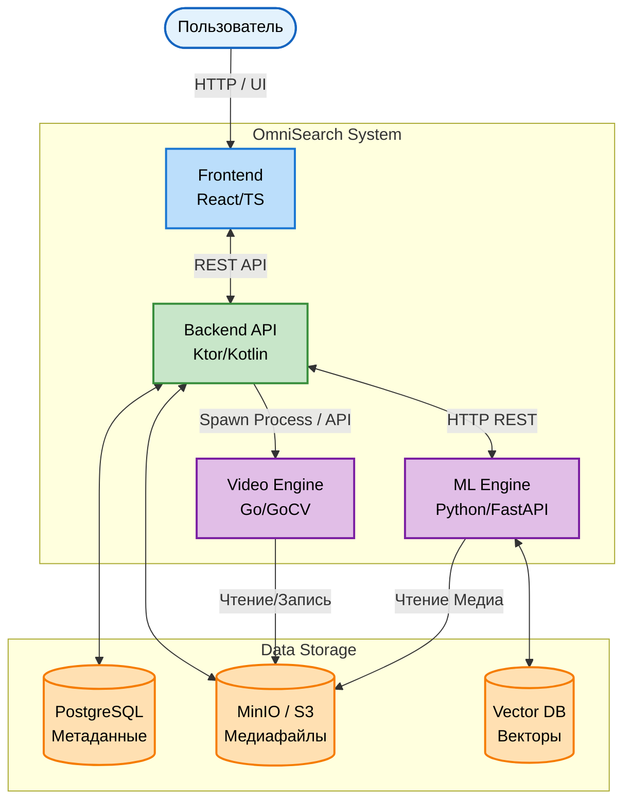
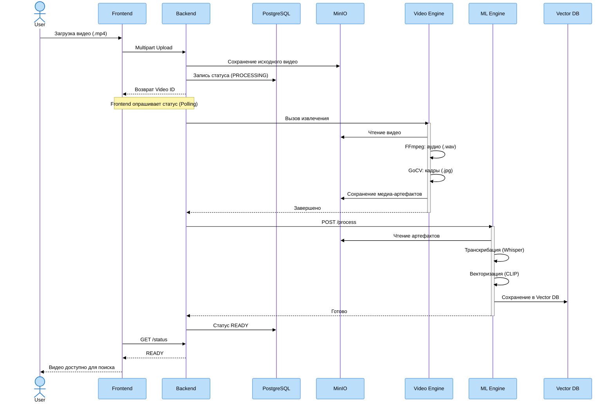
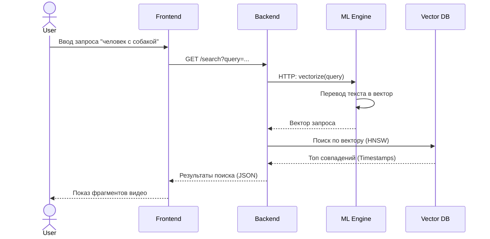

# 🔍 Презентация проекта OmniSearch Engine

## 1. Концепция проекта
**OmniSearch** — это on-premise система семантического поиска по видео. 
Она использует мультимодальный RAG подход, позволяя находить точные моменты в видеоархивах по смысловому текстовому запросу. Система "понимает" и то, что говорят на видео (с помощью транскрибации), и то, что происходит в кадре (благодаря компьютерному зрению).

## 2. Наша Команда
- **Денис (Тимлид, SA, Go VE)** — архитектура системы, проектирование API (API-First), разработка Video Engine на Go (интеграция с CGO и OpenCV).
- **Паша (Backend Ktor)** — оркестратор пайплайнов загрузки, Ktor API, взаимодействие с базами данных и хранилищем, работа с корутинами.
- **Миша (ML)** — Python/FastAPI сервис, интеграция нейросетей Whisper (Speech-to-Text) и CLIP (Vision), генерация и работа с эмбеддингами.
- **Кирилл (Frontend)** — UI/UX приложения, React/TS, загрузка тяжелых файлов, механизмы поллинга статусов обработки, отображение медиаплеера.
- **Максим (DevOps и CI/CD)** — контейнеризация (Multi-stage сборки Docker), docker-compose, настройка пайплайнов (self-hosted GitHub Actions), деплой на удаленный сервер.

## 3. Технологический стек
- **Frontend:** React, TypeScript, Vite.
- **Backend:** Kotlin, Ktor, PostgreSQL, MinIO (S3).
- **Video Engine:** Golang, GoCV (OpenCV bindings), FFmpeg.
- **ML Engine:** Python, FastAPI, PyTorch, Whisper, CLIP, Qdrant / ChromaDB.
- **Инфраструктура:** Docker, GitHub Actions, Nginx.

---

## 4. Архитектурная диаграмма
Взаимодействие компонентов системы и потоки данных:

---

## 5. Пайплайн обработки видео (Ingestion Flow)
Описывает процесс загрузки видео, его нарезку на кадры/аудио и прогон через нейросети для сохранения векторов:

---

## 6. Пайплайн поиска (Retrieval Flow)
Описывает процесс, когда пользователь вводит текстовый запрос, и система мгновенно возвращает нужный видеофрагмент:

