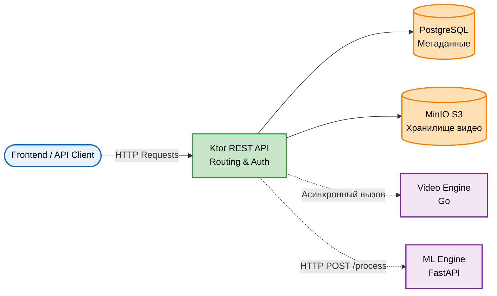
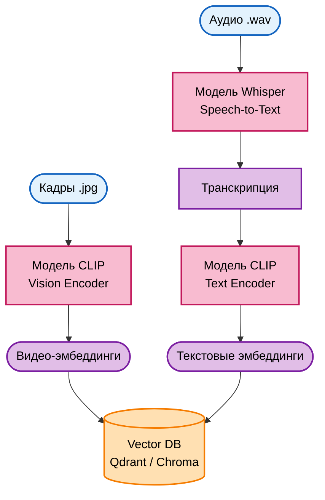
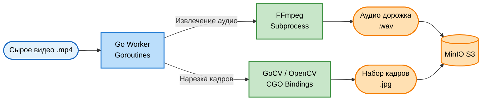
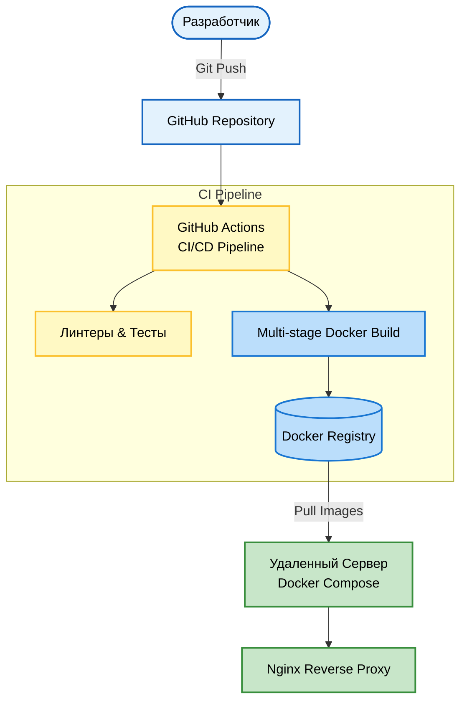

# 📊 Диаграммы для слайдов OmniSearch

Эти диаграммы специально подготовлены для презентации: они светлые, с прозрачным фоном и цветовым кодированием компонентов (синий — вход/клиенты, зеленый — ядро, желтый — хранилища, фиолетовый — модели/внешние сервисы).

## 1. Оркестрация: Backend на Ktor
Слайд для Паши. Фокус на том, как Ktor выступает центральным узлом связи.

## 2. Интеллектуальное ядро: ML Engine
Слайд для Миши. Фокус на двух моделях: Whisper (текст) и CLIP (компьютерное зрение).

## 3. Медиа-движок: Video Engine
Слайд для Дениса. Как Go параллельно извлекает медиа-данные с помощью системных утилит.

## 4. Инфраструктура и CI/CD
Слайд для Максима. Контейнеризация и процесс доставки на удаленный сервер.

